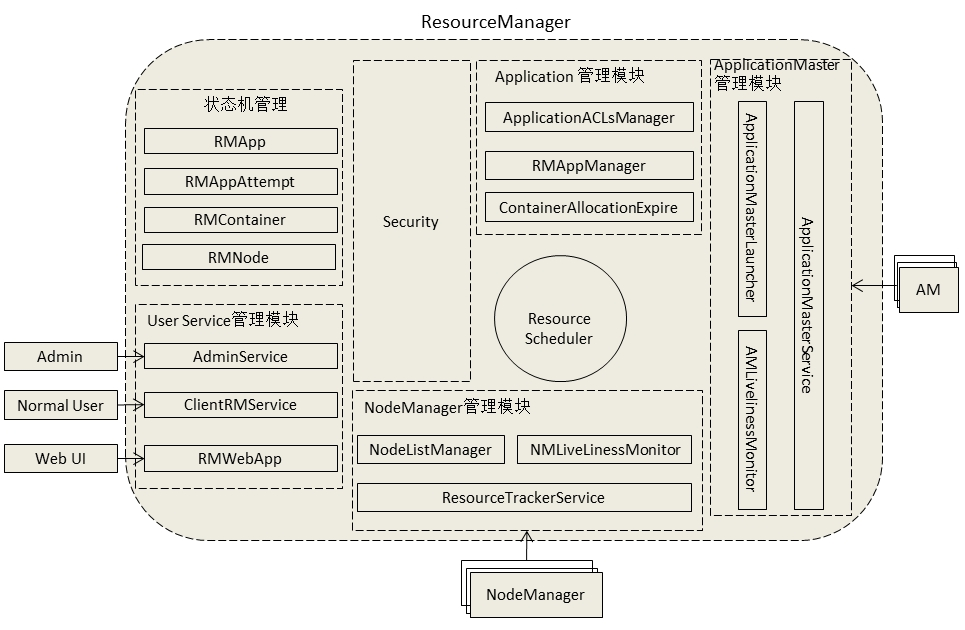
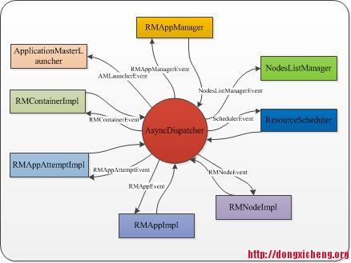

## ResourceManager

### 相关(RPC)协议

#### ResourceTracker
* NM通过ResourceTracker协议向RM注册,汇报节点的健康状况和Container的运行状态, 并领取RM下达的命令.
* 心跳

#### ApplicationMasterProtocol
* AM通过ApplicationMasterProtocol协议向RM注册,申请和释放资源.

#### ApplicationClientProtocol
* 客户端与RM之间的通信协议.
* 用于应用程序的提交,查询,控制.

### 功能模块组成

#### NM管理模块
##### NMLivenessMonitor
监控NM是否活着

##### NodesListManager
维护正常节点和异常节点列表

##### ResourceTrackerService
处理来自NM的请求

#### 状态机管理模块
##### RMApp
维护同一个Application启动的所有运行实例(Attempt)的生命周期

##### RMAppAttempt
维护一次运行尝试(Attempt)的整个生命周期

##### RMContainer
维护一个Container从创建到运行结束的整个周期

##### RMNode
维护一个NM从启动到运行结束的整个周期

#### 资源分配模块(资源调度器)
可插拔式模块

### [事件与事件处理器]( http://dongxicheng.org/mapreduce-nextgen/yarnmrv2-resource-manager-services-and-events/ )

- 处理请求会作为事件进入系统,由中央异步调度器(Async-Dispatcher)负责传递给相应事件调度器(Event Handler)。该事件调度器可能将该事件转发给另外一个事件调度器,也可能交给一个带有有限状态机的事件处理器,其处理结果也以事件的形式输出给中央异步调度器。而新的事件会再次被中央异步调度器转发给下一个事件调度器,直至处理完成(达到终止条件)。

- RM中所有对象都被封装为`服务`和`事件处理器`, `中央异步调度器`将各个服务发送出来的事件按照事件类型分配给对应的事件处理器, 所有事件处理器处理来自中央异步调度器的事件.

### 源码阅读引导
* 源码目录: \*/hadoop-yarn-server-resourcemanager/

#### Java包

##### \*.server.resourcemanager
- 主类, 以及部分内部重要服务的实现
- ResourceManager: main函数所在类
- AdminService: 实现ResourceManagerAdministrationProtocol协议
- ClientRMService: 实现ApplicationClientProtocol协议
- ResourceTrackerService: 实现ResourceTracker协议
- ApplicationMasterService: 实现ApplicationMasterProtocol协议
- RMContextImpl: ResourceManager中的全局上下文信息.

##### \*.server.amlauncher
- 负责AM的启动和停止.
- 两个主要组件: ApplicationMasterLauncher, AMLauncher.
- ApplicationMasterLauncher维护了一个AMLauncher的线程池, 由AMLauncher线程处理AM的启动和停止.

##### \*.server.recovery.*
- 实现了RM重启恢复的相关功能.

##### \*.server.resourcemanager.resource
- 描述了目前yarn支持的资源类型.

##### \*.server.rmapp
- 应用程序状态机(RMAppImpl)的实现,
- RMAppEvent事件的定义.

##### \*.server.rmapp.attempt.*
- AMAppAttemptImpl的实现,
- RMAppAttemptEvent事件的定义.

##### \*.server.resourcemanager.rmcontainer
- Container状态机RMContainerImpl的实现,
- RMContainerEvent事件的定义.

##### \*.server.resourcemanager.rmnode
- 节点状态机RMNodeImpl的实现,
- RMNodeEvent事件的定义.

##### \*.server.resourcemanager.scheduler.*
- 常用资源调度器的实现

##### \*.server.resourcemanager.security.*
- 安全相关的类

##### \*.server.resourcemanager.webapp
- 对外的Web界面

---
<http://blog.51cto.com/zengzhaozheng/1438204>

---
.
