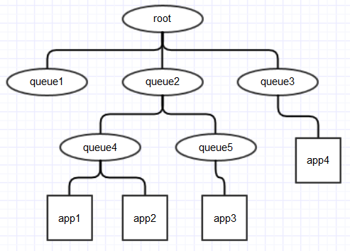

## Scheduler

### 应用程序分类:
根据服务质量的不同要求, 典型的应用可以分为:
- 批处理作业: 耗时较长, 对完成时间没有严格要求. 如 数据挖掘, 机器学习等.
- 交互式作业: 期望能及时返回结果. 如 SQL查询(Hive).
- 生产性作业: 要求有一定的资源保证. 如 统计值计算, 垃圾数据分析.

根据对硬件资源需求量的不同, 可以分为:
- CPU密集型, 如 过滤, 统计类作业.
- I/O密集型, 如 机器学习, 数据挖掘.


### [资源调度器的基本架构]( http://dongxicheng.org/mapreduce-nextgen/yarnmrv2-resource-manager-resource-manager/ )

#### 基本架构


作为一个事件处理器, 需要处理六种事件:
- NODE_REMOVED: 节点移除, 更新可分配资源总量.
- NODE_ADDED: 增加新节点, 更新可分配资源总量.
- APPLICATION_ADDED: RM收到新的Application. 将Application添加到相应的数据结构中.
- APPLICATION_REMOVED: 一个Application运行结束. 将Application从相应的数据结构中删除.
- CONTAINER_EXPIRED: 当分配出去的Container在一定的时间内没有被使用时, 触发CONTAINER_EXPIRED事件, 将其回收.
- NODE_UPDATE: 当RM收到NM通过心跳汇报的信息后, 会触发NODE_UPDATE事件. 该事件会触发调度器最核心的**资源分配机制**.


#### 资源表示模型
虚拟CPU

#### 资源调度模型
- 双层调度模型: RM将资源分配给AM(第一层), AM再将资源分配给各个任务(第二层).
- pull-base模型: 分配给AM的资源是先放在一个缓冲器中, 等待AM通过心跳来取.
- 资源保证机制: 当程序的资源申请需求无法满足时, 先为其预留资源直到累计的空闲资源能够满足程序的需求(增量资源分配).

#### 资源抢占模型
* 为每个队列设置一个最小资源量和最大资源量,
* 将负载较轻的队列的资源暂时分配给负载较重的队列,
* 当负载较轻队列突然收到新提交的应用程序时, 调度器才会将本该属于该队列的资源分配给他.


### [层级队列管理机制]( http://dongxicheng.org/mapreduce/hadoop-hierarchy-queues/ )
- 队列可以嵌套,
- 用户只能将应用程序提交到叶子队列, 因为其他队列**只是一个逻辑概念**用来辅助计算叶子队列的资源量,
- 调度器总是优先选择当前资源使用率最低的队列, 并为之分配资源.

### Capacity Scheduler
- 容量保证: 为每个队列设置资源最低保证和资源使用上限.
- 灵活性: 如果一个队列的资源空闲, 可以暂时共享给其他队列.
- 多重租赁: 支持多用户共享集群和多应用程序同时运行.
- 安全保证: 每个队列有严格的访问控制列表(ACL)规定其访问用户.
- 动态更新配置文件: `$HADOOP_HOME/bin/yarn mradmin -refreshQueues`
- 配置文件: hadoop-yarn-server-resourcemanager/conf/capacity-scheduler.xml

#### 资源调度
- 资源请求协议(hadoop-yarn-api/src/main/proto/yarn_protos.proto):
```
// container的请求描述
message ResourceRequestProto {
  optional PriorityProto priority = 1;      // 优先级
  optional string resource_name = 2;        // 期望资源所在的节点或者机架
  optional ResourceProto capability = 3;    // 资源量
  optional int32 num_containers = 4;        // container数目
  optional bool relax_locality = 5 [default = true];    // 是否松弛本地性(即是否在没有满足节点本地性资源时,选择机架本地性资源)
  optional string node_label_expression = 6;
  optional ExecutionTypeRequestProto execution_type_request = 7;
  optional int64 allocation_request_id = 8 [default = 0];
}
```

- 三级资源分配策略: (同 Fair Scheduler).


### Fair Scheduler
- 资源公平共享: Fair策略.
- 资源抢占: 当某个队列中有剩余资源时, 调度器会将空闲的资源共享给其他队列, 在需要时在将其回收.
- 负载均衡: 基于任务数目的负载均衡机制, 将系统中的任务均匀地分配到各个节点上.
- 调度策略配置灵活: 允许管理员为每个对流单独设置调度策略(FIFO, Fair(基于最大最小平均算法), DRF).
- 提高小应用的相应时间: Fair策略使得小作业可以快速获得资源并完成运行.
- 配置文件: yarn-site.xml(配置调度器级别的参数), fair-scheduler.xml(配置分各个队列的资源量,权重等信息).

#### 资源调度
- [三级资源分配策略](http://jxy.me/2015/04/30/yarn-resource-scheduler/): a)选择(叶子)队列; b)选择应用程序; c)选择container请求.


> 在Fair Scheduler中所有的queue, application都继承了Scheduable, 构成一个树状结构. 分配Container的过程就是深度优先搜索的过程: 从root节点开始, 首先检查当前节点资源是否用满, 是则直接返回(这里会同时考虑CPU和内存). 如果当前节点是ParentQueue, 就将所有子节点排序(SchedulingPolicy决定了这里的顺序), 依次尝试在每个子节点上分配container; 如果当前节点是LeafQueue, 就将下面的app排序(也是SchedulingPolicy决定, 但加入了一些app特有的判断条件), 依次尝试为每个app分配资源; 如果当前节点是app, 会比较当前app的资源需求与节点的剩余资源, 如果能满足, 才真正分配container. 至此整个资源分配过程才完成. 如果找不到合适的app, 最后会返回null.


### 源码阅读引导
- 目录: \*/haddoop-yarn-server/hadoop-yarn-server-resourcemanager/*

#### 相关Java包:
- \*.scheduler: 资源调度器接口的定义: ResourceScheduler(所有调度器主类必须实现的接口), SchedulerNode(用于跟踪集群中一个节点的资源状态), SchedulerApplication(用于追踪一个应用程序的资源分配情况), Queue(描述一个队列的基本信息)...
- \*.scheduler.event: 定义资源调度器需要处理的事件.
- \*.scheduler.common.fica: FIFO和Capacity Scheduler实现中用到的一些公共基础类.
- \*.scheduler.capacity: Capacity Scheduler的实现.
- \*.scheduler.fair: Fair Scheduler.
- \*.scheduler.fifo: FIFO Scheduler.
