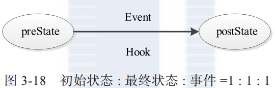
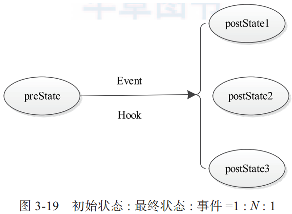
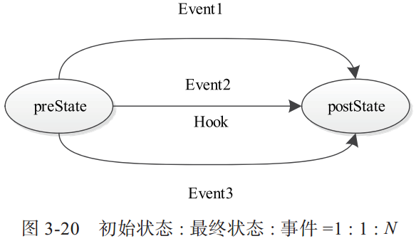
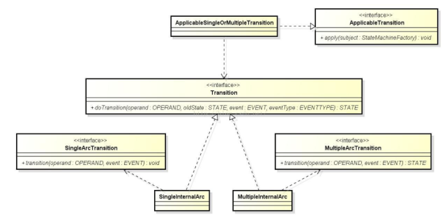

## 状态机库
- src
  hadoop-yarn-common/src/main/java/org/apache/hadoop/yarn/state
- ref:
  [YARN 的状态机库及其使用]( http://blog.csdn.net/lfdanding/article/details/51786110 )
  [Yarn之状态机分析]( https://www.jianshu.com/p/31715a668402 )
  [YARN源码分析之StateMachineFactory状态机]( http://bigdatadecode.club/YARN%E6%BA%90%E7%A0%81%E5%88%86%E6%9E%90%E4%B9%8BStateMachineFactory%E7%8A%B6%E6%80%81%E6%9C%BA.html )
  [Hadoop2.6.0中YARN底层状态机实现分析]( http://www.thebigdata.cn/Hadoop/29896.html )

### 原理分析
> 状态机由一组状态组成，这些状态分为三类：初始状态、中间状态和最终状态。状态机从初始状态开始运行，经过一系列中间状态后，到达最终状态并退出。在一个状态机中，每个状态都可以接收一组特定事件，并根据具体的事件类型转换到另一个状态。当状态机转换到最终状态时，则退出。

#### 状态转换方式
每种状态转换方式由一个四元组表示, 分别是转换前状态（preState）、转换后状态（postState）、事件（event）和回调函数（hook）. YARN中有三种状态转换方式:
1. 一个初始状态, 一个最终状体, 一种事件
在preState下收到Event后, 执行Hook函数, 之后将当前状态转换为postState.


2. 一个初始状态, 多个最终状体, 一种事件
在preState下收到Event后, 执行Hook函数, 由Hook的返回值决定postState.


3. 一个初始状态, 一个最终状体, 多种事件
在preState下收到任意一个Event后, 执行Hook函数, 并将当前状态转换为postState.



### 源码分析


```java
/* 定义FSM的状态转换接口 */
public interface SingleArcTransition<OPERAND, EVENT> {
  // operand为要发生状态改变的实体
  public void transition(OPERAND operand, EVENT event);
}

public interface MultipleArcTransition
        <OPERAND, EVENT, STATE extends Enum<STATE>> {
  public STATE transition(OPERAND operand, EVENT event);
}

public interface StateTransitionListener
    <OPERAND, EVENT, STATE extends Enum<STATE>> {
  // 在状态转换`之前`执行
  void preTransition(OPERAND op, STATE beforeState, EVENT eventToBeProcessed);
  // 状体转换`之后`执行
  void postTransition(OPERAND op, STATE beforeState, STATE afterState,
                      EVENT processedEvent);
}
public abstract class MultiStateTransitionListener
    <OPERAND, EVENT, STATE extends Enum<STATE>> implements
    StateTransitionListener<OPERAND, EVENT, STATE> {
  private final List<StateTransitionListener<OPERAND, EVENT, STATE>> listeners =
                new ArrayList<>();
}

public interface StateMachine<
                 STATE extends Enum<STATE>,
                 EVENTTYPE extends Enum<EVENTTYPE>,
                 EVENT> {
  public STATE getCurrentState();
  public STATE doTransition(EVENTTYPE eventType, EVENT event)
         throws InvalidStateTransitionException;
}

final public class StateMachineFactory
             <OPERAND, STATE extends Enum<STATE>,
              EVENTTYPE extends Enum<EVENTTYPE>, EVENT> {


}

```
