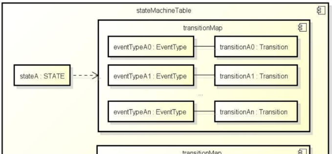
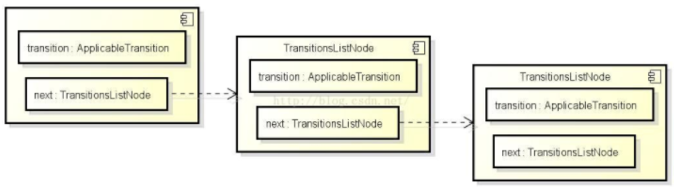

## 状态机库
- src
  hadoop-yarn-common/src/main/java/org/apache/hadoop/yarn/state
- ref:
  [Yarn之状态机分析]( https://www.jianshu.com/p/31715a668402 )
  [YARN 的状态机库及其使用]( http://blog.csdn.net/lfdanding/article/details/51786110 )
  [YARN源码分析之StateMachineFactory状态机]( http://bigdatadecode.club/YARN%E6%BA%90%E7%A0%81%E5%88%86%E6%9E%90%E4%B9%8BStateMachineFactory%E7%8A%B6%E6%80%81%E6%9C%BA.html )
  [Hadoop2.6.0中YARN底层状态机实现分析]( http://www.thebigdata.cn/Hadoop/29896.html )

### 原理分析
> 状态机由一组状态组成，这些状态分为三类：初始状态、中间状态和最终状态。状态机从初始状态开始运行，经过一系列中间状态后，到达最终状态并退出。在一个状态机中，每个状态都可以接收一组特定事件，并根据具体的事件类型转换到另一个状态。当状态机转换到最终状态时，则退出。

每种状态转换由一个四元组表示, 分别是转换前状态（preState）、转换后状态（postState）、事件（event）和回调函数（hook）.

在YARN中四个元组的封装关系如下:
将postState和hook封装成一个SingleInternalArc或MultipleInternalArc类, 通过Transition接口操作.
用一个transitionMap保存event和Transition的映射关系.
最后StataMachineFactory中维护一个stateMachineTable, 维护一个在preState下的transitionMap.

- stateMachineTable: Map<PreState, TransitionMap>
- TransitionMap: Map<EventType, Transition>
- Transition(SingleInternalArc, MultipleInternalArc): <PostState, Hook>




#### YARN中有三种状态转换方式:
1. 一个初始状态, 一个最终状体, 一种事件
在preState下收到Event后, 执行Hook函数, 之后将当前状态转换为postState.


```java
  public StateMachineFactory<OPERAND, STATE, EVENTTYPE, EVENT>
        addTransition(STATE preState,
                      STATE postState,
                      EVENTTYPE eventType,
                      SingleArcTransition<OPERAND, EVENT> hook){

  }
```

2. 一个初始状态, 多个最终状体, 一种事件
在preState下收到Event后, 执行Hook函数, 由Hook的返回值决定postState.


```java
  public StateMachineFactory<OPERAND, STATE, EVENTTYPE, EVENT>
        addTransition(STATE preState,
                      Set<STATE> postStates,
                      EVENTTYPE eventType,
                      MultipleArcTransition<OPERAND, EVENT, STATE> hook){

  }
```

3. 一个初始状态, 一个最终状体, 多种事件
在preState下收到任意一个Event后, 执行Hook函数, 并将当前状态转换为postState.


```java
  public StateMachineFactory<OPERAND, STATE, EVENTTYPE, EVENT>
        addTransition(STATE preState,
                      STATE postState,
                      Set<EVENTTYPE> eventTypes,
                      SingleArcTransition<OPERAND, EVENT> hook) {

  }
```

##### 自底向上


- SingleArcTransition
<p>对外的接口, 只负责收到事件后的具体行为或操作, 不包含任何状态相关的信息.</p>

```java
public interface SingleArcTransition<OPERAND, EVENT> {
  /* Transition hook. */
  public void transition(OPERAND operand, EVENT event);
}
```

- MultipleArcTransition
<p>对外的接口, 只负责收到事件后的具体行为或操作, 不包含任何状态相关的信息.</p>

```java
public interface MultipleArcTransition
        <OPERAND, EVENT, STATE extends Enum<STATE>> {

  /* Transition hook.
     @return the postState. */
  public STATE transition(OPERAND operand, EVENT event);
}

```

- Transition
<p>状态机状态转换过时需要调用的接口, 定义真正的包含状态改变和行为的Transition.</p>

```java
  private interface Transition<OPERAND,
                               STATE extends Enum<STATE>,
                               EVENTTYPE extends Enum<EVENTTYPE>,
                               EVENT> {
    STATE doTransition(OPERAND operand, STATE oldState,
                       EVENT event, EVENTTYPE eventType);
  }
```

- SingleInternalArc
<p>作为Transition接口的实现类，在代理SingleArcTransition的同时，负责状态变换.</p>

```java
  private class SingleInternalArc
                    implements Transition<OPERAND, STATE, EVENTTYPE, EVENT> {
    private STATE postState;
    private SingleArcTransition<OPERAND, EVENT> hook; // transition hook
  }
```

- MultipleInternalArc
<p>作为Transition接口的实现类，在代理SingleArcTransition的同时，负责状态变换.</p>

```java
  private class MultipleInternalArc
              implements Transition<OPERAND, STATE, EVENTTYPE, EVENT>{
    private Set<STATE> validPostStates;
    private MultipleArcTransition<OPERAND, EVENT, STATE> hook;  // transition hook
  }
```

- ApplicableTransition
<p>为了将所有状态机中的状态过渡与状态建立起映射关系，YARN中提供了ApplicableTransition接口用于将SingleInternalArc和MultipleInternalArc添加到状态机的拓扑表中，提高在检索状态对应的过渡实现时的性能.</p>

```java
  private interface ApplicableTransition
             <OPERAND, STATE extends Enum<STATE>,
              EVENTTYPE extends Enum<EVENTTYPE>, EVENT> {
    void apply(StateMachineFactory<OPERAND, STATE, EVENTTYPE, EVENT> subject);
  }
```

- ApplicableSingleOrMultipleTransition
<p>作为ApplicableTransition的实现类, 其apply方法用于代理SingleInternalArc和MultipleInternalArc, 将它们添加到状态拓扑表(stateMachineTable)中. </p>

```java
  static private class ApplicableSingleOrMultipleTransition
             <OPERAND, STATE extends Enum<STATE>,
              EVENTTYPE extends Enum<EVENTTYPE>, EVENT>
          implements ApplicableTransition<OPERAND, STATE, EVENTTYPE, EVENT> {
    final STATE preState;
    final EVENTTYPE eventType;
    final Transition<OPERAND, STATE, EVENTTYPE, EVENT> transition;
    @Override
    public void apply(StateMachineFactory<OPERAND, STATE, EVENTTYPE, EVENT> subject) {
      Map<EVENTTYPE, Transition<OPERAND, STATE, EVENTTYPE, EVENT>> transitionMap
        = subject.stateMachineTable.get(preState);
      if (transitionMap == null) {
        transitionMap = new HashMap<EVENTTYPE,
                                    Transition<OPERAND, STATE, EVENTTYPE, EVENT>>();
        subject.stateMachineTable.put(preState, transitionMap);
      }
      transitionMap.put(eventType, transition);
    }
  }
```

- TransitionsListNode
<p>将ApplicableTransition串联为一个列表</p>

```java
  private class TransitionsListNode {
    final ApplicableTransition<OPERAND, STATE, EVENTTYPE, EVENT> transition;
    final TransitionsListNode next;
  }
```



- StateMachineFactory(主类)
> StateMachineFactory的状态拓扑图是通过多种addTransition让用户添加各种状态转移，最后通过installTopology完成一个状态机拓扑的搭建，其中初始状态是通过StateMachineFactory的构造函数指定的。

```java
final public class StateMachineFactory
             <OPERAND, STATE extends Enum<STATE>,
              EVENTTYPE extends Enum<EVENTTYPE>, EVENT> {

  // 一个链表
  private final TransitionsListNode transitionsListNode;

  // stateMachineTable是为了提高检索状态对应的过渡map而冗余的数据结构,
  // 是在optimized为true时, 通过对transitionsListNode链表进行处理得到.
  private Map<STATE, Map<EVENTTYPE,Transition<OPERAND, STATE, EVENTTYPE, EVENT> > > stateMachineTable;

  private STATE defaultInitialState;

  private final boolean optimized;

  public StateMachineFactory(STATE defaultInitialState){ /*...*/ }

  // addTransition
  public StateMachineFactory<OPERAND, STATE, EVENTTYPE, EVENT> addTransition(
          STATE preState, STATE postState,
          EVENTTYPE eventType,
          SingleArcTransition<OPERAND, EVENT> hook){
    return new StateMachineFactory<OPERAND, STATE, EVENTTYPE, EVENT>(
        this,
        new ApplicableSingleOrMultipleTransition<OPERAND, STATE, EVENTTYPE, EVENT>(
          preState,
          eventType,
          new SingleInternalArc(postState, hook)
        )
    );
  }
  private StateMachineFactory(
            StateMachineFactory<OPERAND, STATE, EVENTTYPE, EVENT> that,
            ApplicableTransition<OPERAND, STATE, EVENTTYPE, EVENT> t){
    //...
    this.transitionsListNode // 构建链表
        = new TransitionsListNode(t, that.transitionsListNode);
    //...
  }


  // installTopology
  public StateMachineFactory<OPERAND, STATE, EVENTTYPE, EVENT>installTopology(){
    return new StateMachineFactory<OPERAND, STATE, EVENTTYPE, EVENT>(this, true);
  }
  private StateMachineFactory(
            StateMachineFactory<OPERAND, STATE, EVENTTYPE, EVENT> that,
            boolean optimized){
    //...
    if (optimized) {
      makeStateMachineTable(); // 通过transitionsListNode链表构建stateMachineTable
    }
    // ...
  }
}

```
