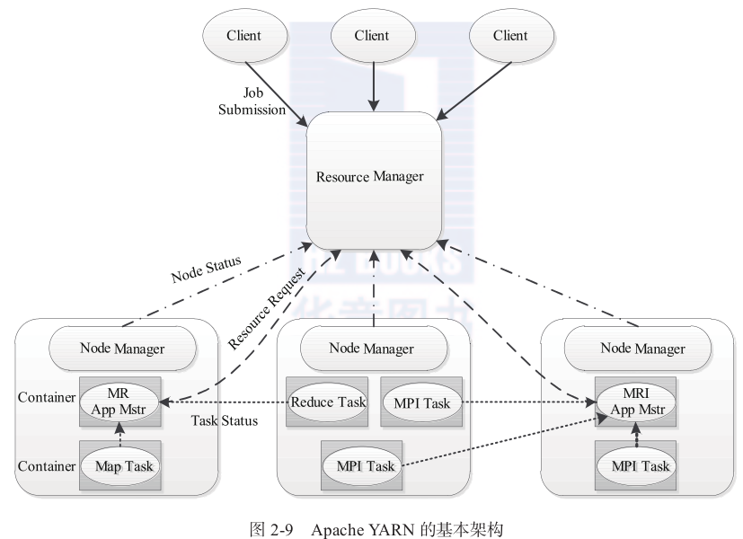
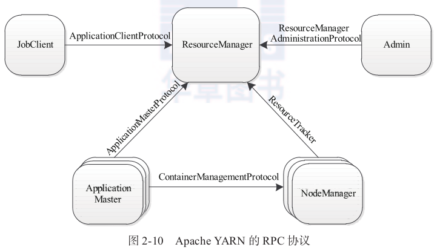
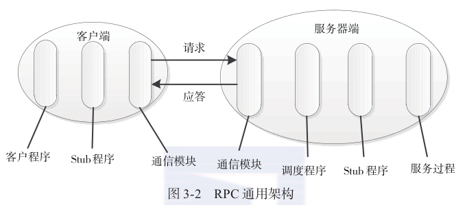
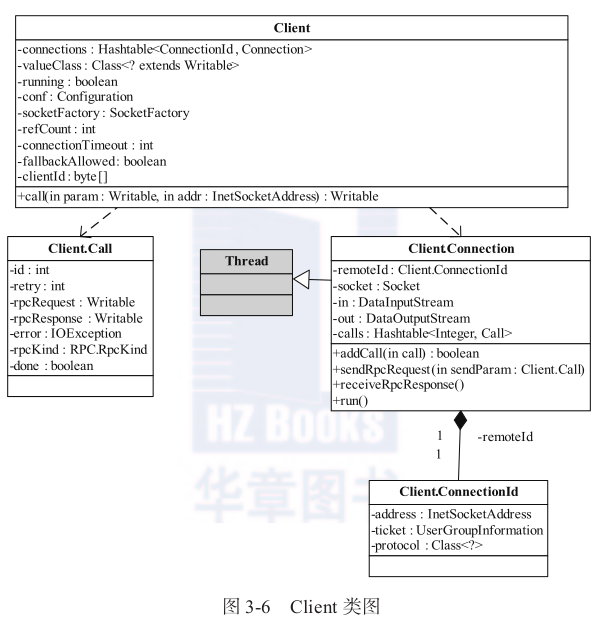
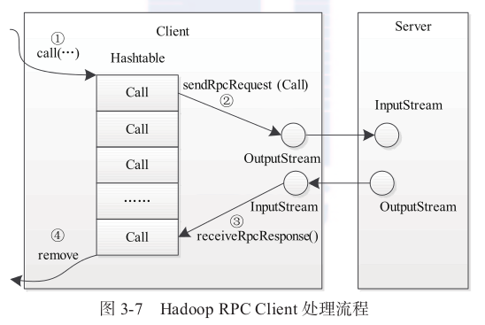
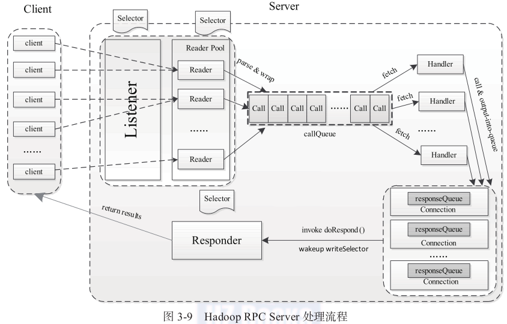
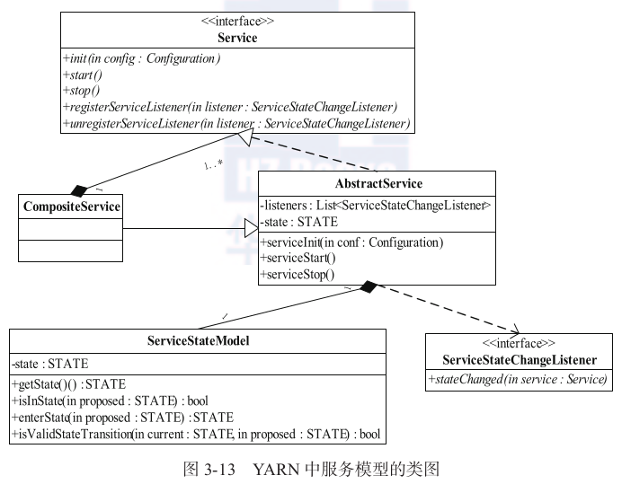
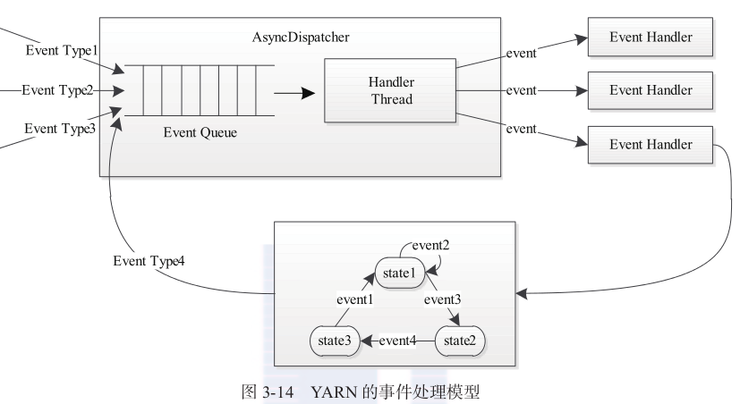
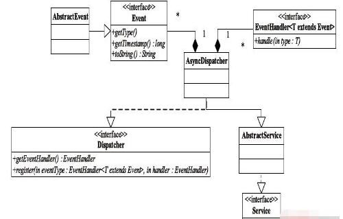

## docker
* 是一个开源的应用容器引擎，让开发者可以打包他们的应用以及依赖包到一个可移植的容器中，然后发布到任何流行的Linux 机器上，也可以实现虚拟化。

## Google Protocol Buffer
* Google Protocol Buffer( 简称 Protobuf) 是 Google 公司内部的混合语言`数据标准`.
* 一种轻便高效的结构化数据存储格式, 可以用于结构化数据的`序列化`和`反序列化`.
* 适合用作`RPC数据交换`和`数据存储`的格式. (类似XML,但更快体积更小)

* Protobuf: Google的编解码框架, 类似XML,Json

* 目前版本的hadoop各种server、client RPC端通信协议的实现是基于google的protocol buffers的，所以我们在编译Hadoop源码之前需要安装好protobuf类库


## maven
* Maven is a software project management and comprehension tool. Based on
the concept of a Project Object Model (POM), Maven can manage a project's
build, reporting and documentation from a central piece of information.

* 项目管理工具


## JUnit
* a test framework


## Linux软件的安装过程是怎样的? 具体有哪些步骤?


## hadoop-yarn 源码分析
### 目录结构:
```
hadoop/
|---hadoop-common-project/      // 其他模块的基础库(RPC,Counter)
|---hadoop-dfs-project/         // 分布式文件系统
|---hadoop-mapreduce-project/   // mapreduce框架
+---hadoop-yarn-project/        // yarn资源管理系统
    |---api/                        // 四个主要RPC协议的java声明和Protocol Buffer定义
    |---application/                // 两个编程实例: distributedshell, Unmanaged AM
    |---common/                     // 底层库的实现(事件库,服务库,状态机库,web界面库)
    |---client/                     // 封装了用于应用开发的库
    +---server/                     // ResourceManager, NodeManager等核心实现
```


### 基本组成结构


#### ResourceManager
* 全局资源管理器, 负责整个系统的资源管理和分配
* 由`调度器`和`应用程序管理器`构成

##### 1. 调度器
* 根据容量和队列等限制条件, 将系统的资源分配给各个正在运行的应用程序
* 是一个可插拔组件, 可根据需要设计新的调度器

##### 2. 应用程序管理器
* 管理整个系统中的所有应用程序,
* 确切的说是管理各个应用程序的ApplicationMaster


#### ApplicationMaster
* 向RM申请资源
* 将资源分配给内部的各个task
* 与NM一起管理各个task

#### NodeManager
* 每个节点上的任务和资源管理器
* 定时向RM汇报本节点的`资源使用情况`和`各个Container的运行状态`
* 处理来自AM的对Container的各种请求

#### Container
* 资源容器, 对资源进行封装


### 通信协议



### yarn 基础库

#### Protocol Buffer(Protobuf)


#### Apache Avro
* 既是一个序列化框架, 同时也实现了RPC的功能
* 在YARN中用作日志序列化库

#### Remote Procedure Call(RPC)
* 远程过程调用, 一种常用的分布式网络通信协议.
* 允许一台计算机上的程序调用另一台上的子程序, 同时将网络通信的细节隐藏, 简化分布式程序的开发.
* 基于C/S模型

##### RPC通用架构

- Stub程序: 一个代理程序, 保证函数调用的透明性
- 调度程序: 接收来自通信模块的请求消息, 并根据其中的标识选择一个Stub程序来处理


##### Hadoop RPC的主要类
1. **RPC**
  * 对底层C/S模型的封装

2. **Client**

  * 两个内部类:
  * Call: 封装RPC请求
  * Connection: 将Client和Server之间的连接的基本信息及相关操作进行封装
  * 处理流程
  

  <p>a) 创建一个Connection对象, 并将远程方法的调用信息封装成Call对象, 放到Connection对象的哈希表中;</p>
  <p>b) 调用Connection.sendRcpRequest方法, 将Call对象发送给Server;</p>
  <p>c) 通过Connection.receiveRcpResponse方法, 接收Server的处理结果;</p>
  <p>d) 检查结果的状态, 并将Call对象从哈希表中删除;</p>

3. **Server**
  * 采用`Reactor`设计模式
  * 工作流程


<p>a) 接受请求: </p>
    包含`建立连接`和`接收请求`两个子阶段, 分别由Listener和Reader两种线程完成. 对于Listener线程, 主循环是监听是否有新的`连接请求`到达, 并采用轮询的方式从线程池中选择一个Reader线程处理新连接; 对于Reader线程, 主循环是监听所负责的`客户端连接`中是否有新的`RCP请求`, 并将新到的RCP请求封装成Call对象, 放到共享队列callQueue中.
<p>b) 处理请求: </p>
    Handler线程从callQueue队列中读取Call对象, 执行对应的函数调用后, 先尝试将结果直接返回给对应的客户端, 如果结果没能一次性返回则将后续的发送任务交给Response线程.
<p>c) 返回结果: </p>
    Response线程内部包含一个Selector对象, 当Handler没能将结果一次性返回时会向Selector对象注册SelectionKey.OP_WRITE事件, 进而由Response线程采用异步的方式继续发送结果.


### 服务库
* 采用基于服务的对象管理模型对长生命周期的对象进行管理:
  <p> 四个状态: NOTINITED(被创建), INITED(已经初始化), STARTED(已经启动), STOPED(已经停止) </p>
  <p> 任何服务状态的变化都可以出触发另外的一些动作 </p>
  <p> 可以通过组合的方式对任意服务进行组合, 以便进行统一管理 </p>



* 包名: hadoop-common/org.apache.hadoop.service
```java
// org.apache.hadoop.service
// Observer设计模式

public interface Service extends Closable{
  // Service的基本定义
}

publice class ServiceStateModel{
  /* 服务的状态模型, 保证状态之间转换的合法性 */
    private static final boolean[][] statemap = {
      //                uninited inited started stopped
      /* uninited  */    {false, true,  false,  true},
      /* inited    */    {false, true,  true,   true},
      /* started   */    {false, false, true,   true},
      /* stopped   */    {false, false, false,  true},
    };
    public static boolean isValidStateTransition(Service.STATE current,
                                               Service.STATE proposed) {
      return statemap[current.getValue()][proposed.getValue()];
  }
}

public class AbstractService implements Service{
  // Service的基本实现:
  // 服务状态的转换操作, 与ServiceStateChangeListener的通信
}

public class CompositeService extends AbstractService{
  // 维护多个服务
  private final List<Service> serviceList = new ArrayList<Service>();
}


public interface ServiceStateChangeListener{
  // 定义服务状态改变时的回调接口
  void stateChanged(Service service);
}

public final class ServiceOperations {
  // 定义了对服务的一些操作
notify
  public static class ServiceListeners {
    // 记录一个服务的Listener, 当服务的状态改变时, 会通过notifyListeners函数
    // 回调所有Listener的stataChanged接口通知各个Listener
    private final List<ServiceStateChangeListener> listeners =
      new ArrayList<ServiceStateChangeListener>();
  }
}
```


### 事件库
* 基于事件驱动的并发模型, 将各种处理逻辑抽象成事件和对应事件调度器, 并将每类事件的处理过程分割成多个步骤用`有限状态机`表示.


处理请求会作为事件进入系统,由中央异步调度器(Async-Dispatcher)负责传递给相应事件调度器(Event Handler)。该事件调度器可能将该事件转发给另外一个事件调度器,也可能交给一个带有有限状态机的事件处理器,其处理结果也以事件的形式输出给中央异步调度器。而新的事件会再次被中央异步调度器转发给下一个事件调度器,直至处理完成(达到终止条件)。

* 事件库: hadoop-yarn-common/src/main/java/org/apache/hadoop/yarn/event


```java
public interface Event<TYPE extends Enum<TYPE>> {
  // 定义事件的接口
}

public abstract class AbstractEvent<TYPE extends Enum<TYPE>>
    implements Event<TYPE> {
  // 实现事件接口
}

public interface EventHandler<T extends Event>{
  // 定义处理`T`类型事件的接口
  void handle(T event);
}

public interface Dispatcher {
  // 事件调调度接口
}

public class AsyncDispatcher
    extends AbstractService implements Dispatcher {
  // 异步调度器

  private final EventHandler handlerInstance = new GenericEventHandler();
  private Thread eventHandlingThread;
  private final BlockingQueue<Event> eventQueue;
  protected final Map<Class<? extends Enum>, EventHandler> eventDispatchers;

  public void register(Class<? extends Enum> eventType,
                       EventHandler handler) {
    // 对外的事件处理器注册接口
    eventDispatchers.put(eventType, handler);
  }

  protected void serviceStart() throws Exception {
    super.serviceStart();
    eventHandlingThread = new Thread(createThread());
  }
  Runnable createThread() {
    return new Runnable() {
      @Override
      public void run() {
        while (!stopped && !Thread.currentThread().isInterrupted()) {
          /* 从eventQueue中取出一个事件,
             然后根据事件类型从eventDispatchers中找到对应的EventHandler进行处理.
          */
        }
      }
    };
  }

  public EventHandler getEventHandler() {
    // 对外的事件调度接口
    return handlerInstance;
  }
  class GenericEventHandler implements EventHandler<Event> {
    public void handle(Event event) {
      eventQueue.put(event);
    }
  }

  static class MultiListenerHandler implements EventHandler<Event> {
    // 用于处理一个Event有多个Handler的情况
     List<EventHandler<Event>> listofHandlers;
  }
}
```


service => event => statemachine => fifo scheduler => fair scheduler => my scheduler
